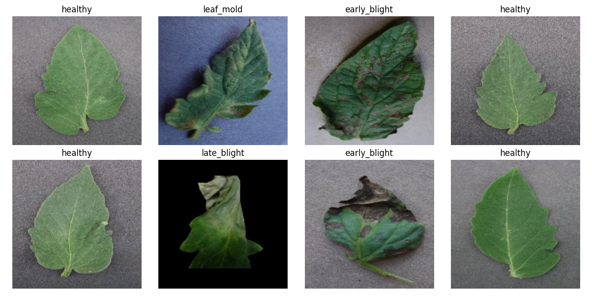
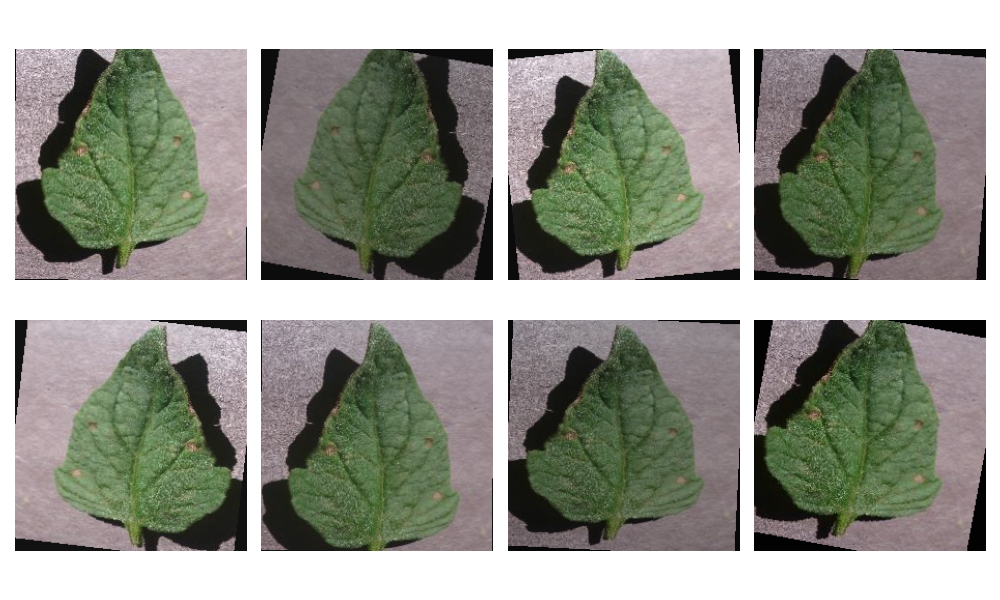
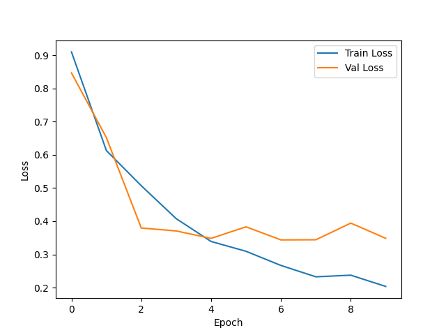
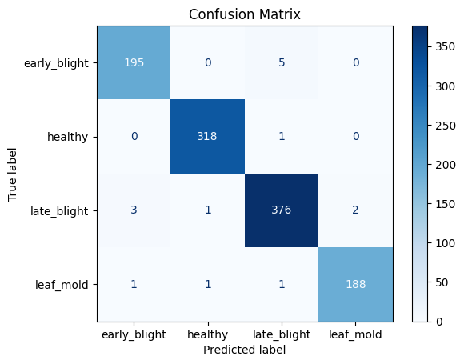

# Plant Leaf Disease Detection Pipeline

## Capstone Report

**Author:** Ami Asok
**Project:** Plant Leaf Disease Detection using Deep Learning
**Framework:** PyTorch
**API Framework:** FastAPI
**Deployment:** Docker

---

# 1. Dataset & Agritech Problem

## Problem Statement

Plant diseases are one of the major causes of crop yield loss worldwide. Early detection helps farmers take preventive measures before diseases spread across fields. Traditional disease identification requires agricultural expertise and manual inspection, which can be time-consuming and impractical for large farms.

This project develops an automated plant leaf disease detection system using deep learning. Given an image of a tomato leaf, the system predicts whether the leaf is healthy or affected by one of several common diseases. The trained model is deployed through a REST API, allowing easy integration into future web or mobile applications.

---

## Dataset

The dataset contains tomato leaf images belonging to four classes.

| Class        |   Images |
| ------------ | -------: |
| Early Blight |     1000 |
| Healthy      |     1591 |
| Late Blight  |     1909 |
| Leaf Mold    |      952 |
| **Total**    | **5452** |

---

## Dataset Split

| Dataset    | Percentage |
| ---------- | ---------: |
| Training   |        80% |
| Validation |        20% |

The training set was used to learn model parameters, while the validation set was used to evaluate model performance on unseen images.

### Sample Training Batch



*Figure 1. A sample batch of tomato leaf images(here,8 images per batch) loaded by the DataLoader before training.*

---

## Data Preprocessing

All images were converted into a common format before training.

### Training Transformations

* Resize (256 × 256)
* Random Resized Crop (224 × 224)
* Random Horizontal Flip
* Random Rotation (±15°)
* Color Jitter
* Convert to Tensor
* Normalize using ImageNet Mean and Standard Deviation

### Validation Transformations

* Resize (224 × 224)
* Convert to Tensor
* Normalize using ImageNet Mean and Standard Deviation

Data augmentation improves generalization by exposing the model to different viewpoints, lighting conditions, and orientations during training.

### Data Augmentation Examples



*Figure 2. Examples of image augmentation techniques including random crop, flip, rotation, and color jitter applied during training.*

---

# 2. Architecture & Training Choices

## Baseline CNN

The initial model was a custom Convolutional Neural Network consisting of:

* Convolution Layer (32 filters)
* ReLU Activation
* Max Pooling
* Convolution Layer (64 filters)
* ReLU Activation
* Max Pooling
* Convolution Layer (128 filters)
* ReLU Activation
* Max Pooling
* Convolution Layer (256 filters)
* ReLU Activation
* Adaptive Average Pooling
* Fully Connected Layer
* Dropout (0.3)
* Output Layer (4 classes)

### Baseline Performance

| Metric              |  Value |
| ------------------- | -----: |
| Validation Accuracy | 93.50% |
| Validation Loss     | 0.3581 |

Although the custom CNN achieved good performance, there was room for improvement in feature extraction and generalization.

---

## Transfer Learning using ResNet18

To improve performance, transfer learning was applied using a pretrained ResNet18 model.

The following steps were performed:

* Loaded ImageNet pretrained weights.
* Replaced the final fully connected layer with a four-class classifier.
* Initially trained only the classifier.
* Fine-tuned Layer4 together with the classifier.

### Why ResNet18?

ResNet18 was selected because:

* Residual connections improve gradient flow.
* Faster convergence compared to training from scratch.
* Better feature extraction from limited datasets.
* Lower computational requirements than deeper ResNet models.

### Final Performance

| Metric              |  Value |
| ------------------- | -----: |
| Validation Accuracy | 98.63% |
| Validation Loss     | 0.0645 |

---

## Model Comparison

| Model      | Validation Accuracy |
| ---------- | ------------------: |
| Custom CNN |              93.50% |
| ResNet18   |              98.63% |

Transfer learning significantly improved accuracy while reducing validation loss.

### Training Curves



*Figure 3. Training and validation accuracy/loss during model training. The ResNet18 model converges with high accuracy and low validation loss.*

---

# 3. Metrics & Error Analysis

## Classification Metrics

The final ResNet18 model achieved the following performance.

| Class        | Precision | Recall | F1-Score |
| ------------ | --------: | -----: | -------: |
| Early Blight |      0.98 |   0.97 |     0.98 |
| Healthy      |      0.99 |   1.00 |     1.00 |
| Late Blight  |      0.98 |   0.98 |     0.98 |
| Leaf Mold    |      0.99 |   0.98 |     0.99 |

---

## Overall Performance

| Metric            | Value |
| ----------------- | ----: |
| Accuracy          |   99% |
| Macro F1 Score    |  0.99 |
| Weighted F1 Score |  0.99 |

The model demonstrates strong and balanced performance across all four disease classes.

---

## Confusion Matrix



*Figure 4. Confusion matrix of the ResNet18 model evaluated on the validation dataset.*


## Confusion Matrix Analysis

The confusion matrix indicates that most validation images were correctly classified.

Healthy leaves achieved nearly perfect classification accuracy.

Most prediction errors occurred between:

* Early Blight
* Late Blight

These diseases often exhibit visually similar symptoms, making them more difficult to distinguish.

---

## Error Analysis

Misclassified images were primarily caused by:

* Similar disease symptoms
* Poor lighting conditions
* Blurred images
* Partial leaf visibility
* Background interference

These challenges are commonly encountered in real agricultural environments.

---

# 4. API Deployment

After training, the best-performing ResNet18 model was deployed using FastAPI.

## API Features

* Loads the trained model during application startup.
* Accepts uploaded leaf images.
* Performs preprocessing identical to training.
* Returns predicted disease class.
* Returns confidence score.
* Reports inference time.

---

## Available Endpoints

### Health Check

```
GET /health
```

Example response:

```json
{
  "status": "ok",
  "model_loaded": true
}
```

---

### Prediction

```
POST /predict
```

Supported formats:

* JPG
* JPEG
* PNG

Example response:

```json
{
  "class_name": "late_blight",
  "confidence": 0.9999,
  "inference_ms": 94.12
}
```

---

## Docker Deployment

The application was containerized using Docker to ensure portability and reproducibility.

### Build

```bash
docker build -t leaf-disease-api .
```

### Run

```bash
docker run -p 8000:8000 leaf-disease-api
```

Containerization removes dependency conflicts and enables deployment on different systems with minimal setup.

---

# 5. Ethics & Privacy for Field Imagery

Although this project uses publicly available datasets, practical deployment requires careful consideration of ethics and privacy.

## Privacy Considerations

Images collected from farms may contain:

* GPS metadata
* Farm locations
* Personal property
* Sensitive agricultural information

Such information should not be stored or shared without the owner's permission.

---

## Responsible Use

The model should be used as a decision-support tool rather than replacing expert agricultural advice.

Incorrect predictions may result in:

* Incorrect pesticide usage
* Crop damage
* Financial losses

Farmers should verify important decisions through agricultural experts whenever possible.

---

## Dataset Limitations

This project only classifies four tomato leaf conditions.

The model may not generalize well to:

* Different crops
* Previously unseen diseases
* Images captured under extreme lighting conditions
* Different geographical environments

Expanding the dataset would improve robustness and real-world performance.

---

# Future Improvements

Potential future enhancements include:

* Support for additional crop species
* Mobile application integration
* Cloud deployment
* Explainable AI using Grad-CAM
* Larger and more diverse datasets
* Real-time field diagnosis

---

# Conclusion

This project successfully developed an end-to-end plant leaf disease detection pipeline using deep learning. A custom CNN served as the baseline model, while transfer learning with ResNet18 significantly improved classification performance.

The final system achieved approximately **99% accuracy**, was deployed as a **FastAPI REST API**, and containerized using **Docker** for portable deployment. The project demonstrates a complete machine learning workflow covering dataset preparation, model training, evaluation, deployment, and ethical considerations, making it suitable as a foundation for future smart agriculture applications.
